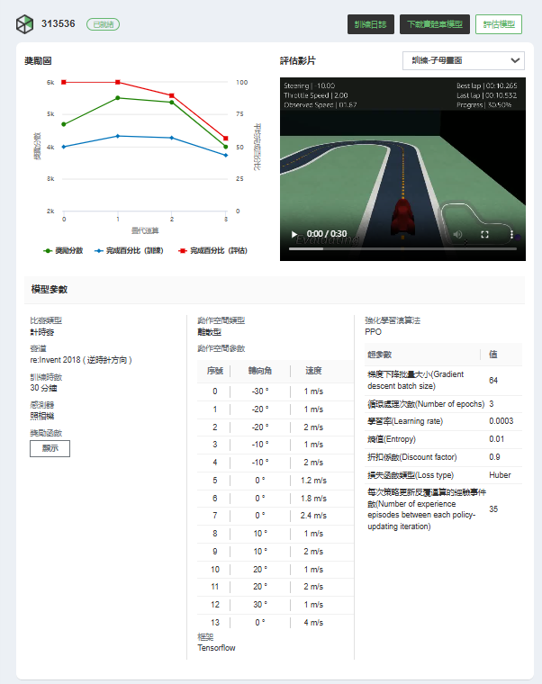
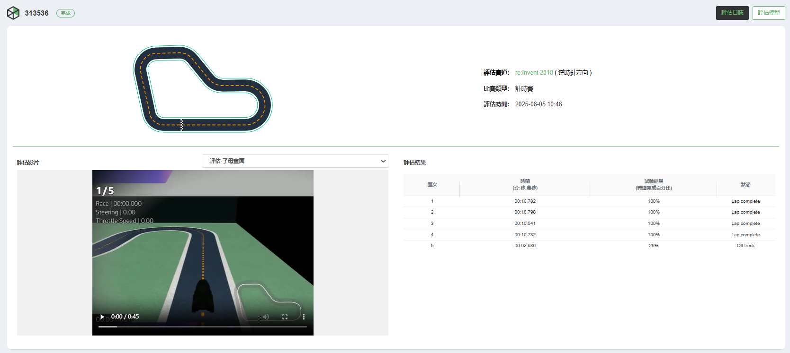
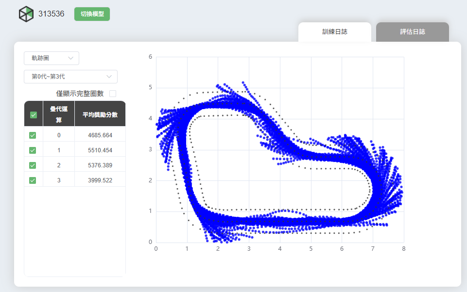
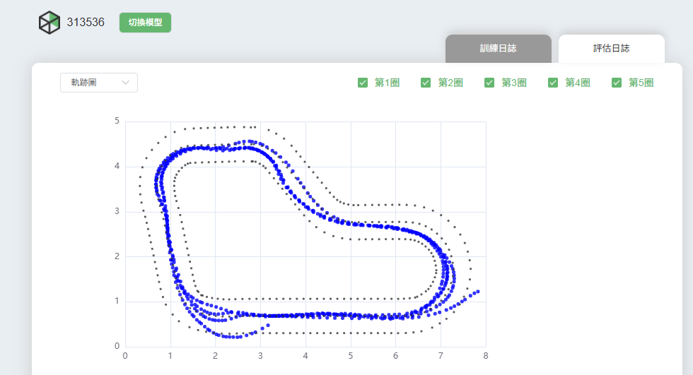
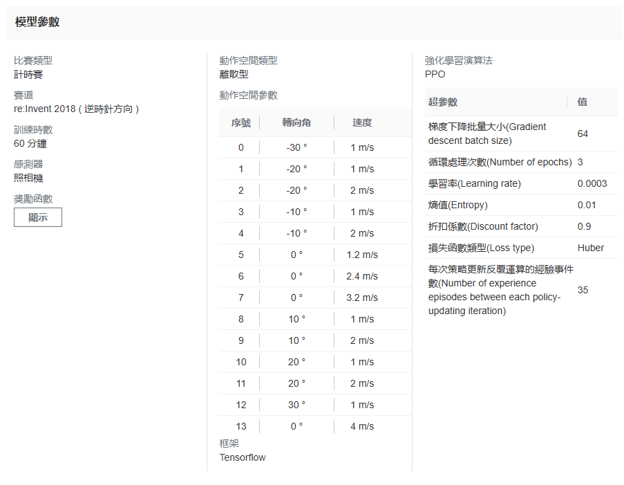
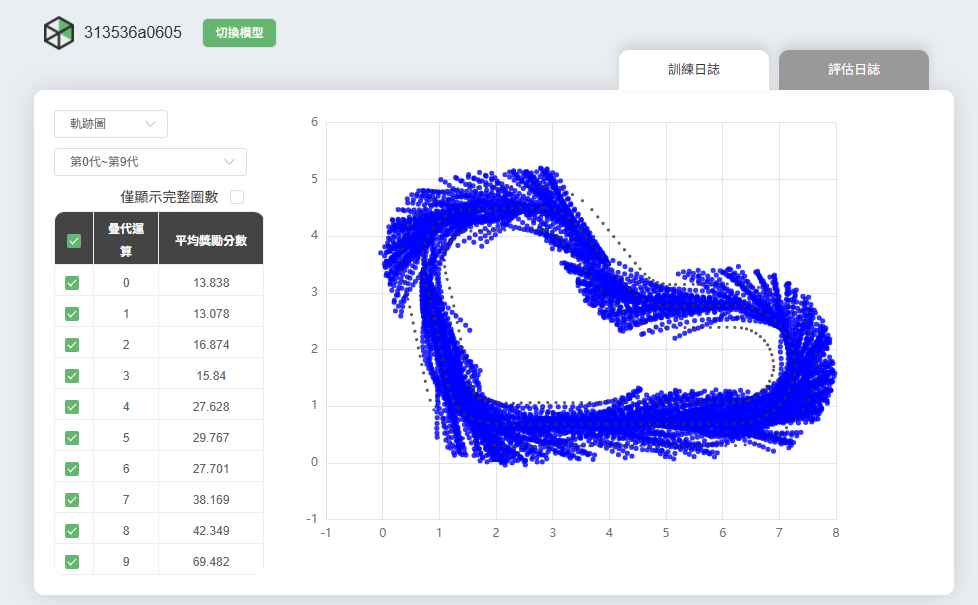
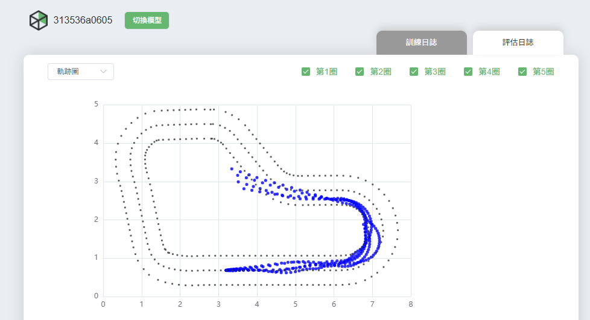
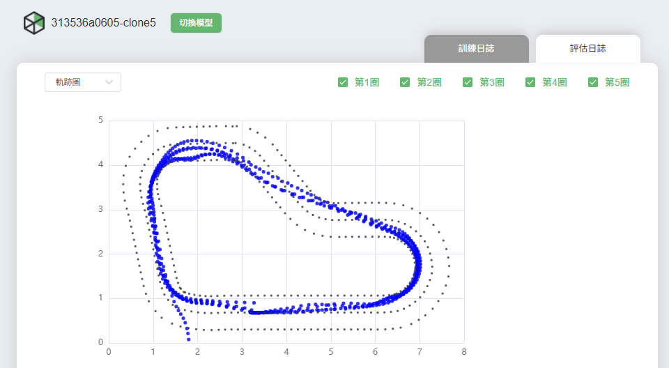

# AI_CAR_1_QQnumberOne
課程名稱：機器學習 
班級：電子三乙 
學號及姓名：111360231呂佳家、111360235馬赫行、111360236謝子涵 
組名：第一組 QQnumberOne 

# 線下賽部分
模型名稱：313536 
 

選用這個模型的理由： 
由以下評估模型可以看到，賽車模型的完成率非常高，表示比較穩定，可以減少賽車出軌的機率，其中有4個都達到100%。 

 

獎勵函數： 
[點我看文字檔](reward%20funtion/313536.txt) 

訓練日誌： 
 

評估日誌： 
 

線下賽最快的時間：12.36秒 
名次：1/11 

# 線上賽部分
最初始模型名稱：313536a0605 
從313536a0605這個模型開始修正到313536a0605-clone5 
其他參數(除了順練時數之外，都與下圖-clone5相同)： 
 

 
訓練時數(min)： 

| 313536a0605 | -clone1  | -clone2  | -clone3  | -clone4  | -clone5  |
|---------------|----------|----------|----------|----------|----------|
| 30                   | 60           | 60           | 60           | 60           | 60           |

 

獎勵函數(這六個模型都是使用這個獎勵函數進行訓練)： 
[點我看文字檔](reward%20funtion/313536a0605.txt) 
獎勵函數參考來源： 
[github連結](https://github.com/yang0369/AWS_DeepRacer/blob/main/reward_function(1.5).py) 

獎勵圖比較： 
 

訓練日誌： 
最初的模型(313536a0605) 
 
最終的模型(313536a0605-clone5) 
 

評估日誌： 
最初的模型(313536a0605) 
 
最終的模型(313536a0605-clone5) 
 
由這兩張圖比較可得知，經歷了5.5小時的訓練的評估結果是比只訓練30分鐘的穩定很多，而且也比較接近最佳賽車線。 

線上賽最快的時間：8.602秒 

